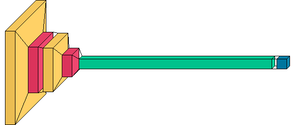

# GenderClassifier
## Gender Classification using Convolutional Neural Networks
*** 
NOTE: This GitHub page collects the code that has been adopted in the following article: 
*** 
Hello boys and girls! 
This algorithm is a simple Gender Classifier that has been trained on a portion of [this dataset](https://www.kaggle.com/nipunarora8/age-gender-and-ethnicity-face-data-csv)
The model is a simple Convolutional Neural Network whose structure is the following one



In the notebook __GenderClassifierNotebook.ipynb__ , more details about the dataset can be found, the training process is explained and the results are explored. Plus, the __classifier.py__ python permits to adopt the pre-trained version of the model and apply it to your image. An example of the usage of this software is the following:
```python
python classifier.py --image_path /path/to/image --model_path /path/to/model
```

The usage of this code to the __test.JPG__ image gave the following output:

```python
The prediction for the input image is Male with probability 98.79%
```


Enjoy! 

Piero.
